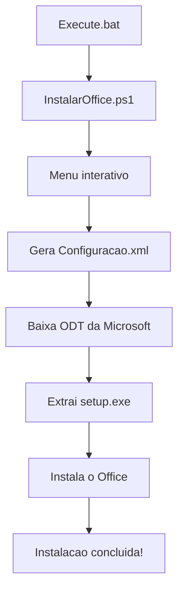

<div align="center">


# Office Installer

**Instale o Microsoft Office de forma oficial, rápida e sem complicação.**  
Powered by Office Deployment Tool (ODT) — direto dos servidores da Microsoft.


</div>

---

## 📋 Sobre o Projeto

O **Office Installer** é uma ferramenta open source que automatiza a instalação do Microsoft Office utilizando o [Office Deployment Tool (ODT)](https://learn.microsoft.com/pt-br/deployoffice/overview-office-deployment-tool) oficial da Microsoft.

Sem downloads suspeitos, sem cracks, sem riscos. Todo o processo é feito diretamente pelos servidores da Microsoft.

---

## ✨ Funcionalidades

- ✅ Instalação 100% oficial via ODT da Microsoft
- ✅ Suporte a Office 2024, 2021 e 2019
- ✅ Escolha de arquitetura (64-bit ou 32-bit)
- ✅ Escolha de idioma (PT-BR, EN, ES)
- ✅ Escolha de canal de atualização
- ✅ Geração automática do arquivo de configuração XML
- ✅ Interface interativa via menu no terminal
- ✅ Execução automática como Administrador

---

## 🚀 Como instalar

### ⚡ Opção 1 — Automático (Recomendado)

> Para quem quer instalar com poucos cliques, sem complicação.

**1. Clone o repositório ou baixe o ZIP**

```bash
git clone https://github.com/derikolis/Pacote-Office.git
```

Ou clique em **Code → Download ZIP** e extraia os arquivos.

**2. Execute o instalador**

Clique duas vezes em `Execute.bat` — ele solicitará permissão de Administrador automaticamente.

**3. Siga o menu interativo**

```
============================================
 INSTALADOR OFFICE - by Derik Oliveira
============================================

Qual versao do Office deseja instalar?

  [1] Office 2024
  [2] Office 2021
  [3] Office 2019

Digite um numero:
```

**4. Aguarde a instalação**

O instalador irá:
- Baixar o Office Deployment Tool da Microsoft
- Gerar o arquivo de configuração automaticamente
- Iniciar a instalação do Office

> ⏱️ A instalação pode levar entre **10 e 30 minutos** dependendo da sua conexão.

---

### 🛠️ Opção 2 — Manual

> Para quem prefere ter controle total sobre cada etapa do processo.

**1.** Crie uma nova pasta no **Disco Local (C:)** chamada **MSOfficeSetup**

**2.** Acesse a [Ferramenta de Personalização do Office](https://config.office.com/deploymentsettings), configure os aplicativos desejados e exporte no formato **Office Open XML**

> Arquivo gerado: `configuração.xml`

**3.** Baixe a [Ferramenta de Implantação do Office](https://www.microsoft.com/en-us/download/details.aspx?id=49117)

> Arquivo: `officedeploymenttool_17531-20046.exe`

**4.** Coloque os dois arquivos dentro da pasta `C:\MSOfficeSetup`

**5.** Execute o `officedeploymenttool_17531-20046.exe`, aceite os termos e selecione o caminho da pasta:
> **Este Computador → Disco Local (C:) → MSOfficeSetup**

**6.** Abra o **Prompt de Comando (CMD) como Administrador** e execute:

```bash
cd\
cd MSOfficeSetup
setup.exe /configure configuração.xml
```

**7.** Aguarde a instalação concluir.

---

## ⚙️ Opções disponíveis (Instalador Automático)

| Configuração | Opções |
|---|---|
| **Versão** | Office 2024, Office 2021, Office 2019 |
| **Arquitetura** | 64-bit *(recomendado)*, 32-bit |
| **Idioma** | Português Brasil, Inglês, Espanhol |
| **Canal** | Atual *(atualizações frequentes)*, Empresarial *(mais estável)* |

---

## 📁 Estrutura do projeto

```
📁 Pacote-Office/
├── 📄 Execute.bat           # Arquivo de execução (clique aqui)
├── 📄 InstalarOffice.ps1    # Script principal do instalador
├── 📄 LICENSE               # Licença MIT
└── 📄 README.md             # Documentação
```

---

## 🔧 Como funciona



---

## ⚠️ Aviso importante

Esta ferramenta instala o Microsoft Office em modo de avaliação. Para utilizar sem restrições, é necessária uma **licença válida** adquirida diretamente da [Microsoft](https://www.microsoft.com/pt-br/microsoft-365).

---

## 🤝 Contribuindo

Contribuições são bem-vindas! Sinta-se à vontade para:

1. Fazer um **fork** do projeto
2. Criar uma **branch** para sua feature (`git checkout -b feature/MinhaFeature`)
3. Fazer o **commit** das suas alterações (`git commit -m 'Add MinhaFeature'`)
4. Fazer o **push** para a branch (`git push origin feature/MinhaFeature`)
5. Abrir um **Pull Request**

---

## 🔍 Referências

- [Ferramenta de Personalização do Office](https://config.office.com/deploymentsettings)
- [Ferramenta de Implantação do Office](https://www.microsoft.com/en-us/download/details.aspx?id=49117)
- [Documentação Microsoft](https://learn.microsoft.com/pt-br/deployoffice/admincenter/overview-office-customization-tool)

---

## 📄 Licença

Distribuído sob a licença MIT. Veja o arquivo [LICENSE](LICENSE) para mais detalhes.

---

<div align="center">

Feito por **Derik Oliveira**

[](https://github.com/derikolis)

</div>